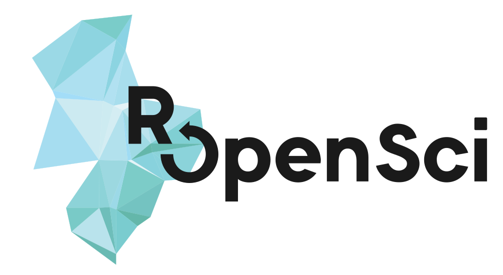

```{r xaringan-themer, include=FALSE, warning=FALSE}
library(xaringanthemer)

style_mono_light(
  base_color = "#1c5253",
  header_font_google = google_font("Roboto"),
  text_font_google   = google_font("Work Sans"),
  code_font_google   = google_font("Work Sans"),
  title_slide_text_color = "#216D6D",
  colors = 
    c(lightgreen = "#216D6D",
    purple = "#8749AD",
    lila = "#CF92F4",
    black = "black",
    green = "#1c5253",
    darkgreen = "#104949",
    white = "#FFFFFF",
    lighty = "#E8EDED",
    red = "#A43543",
    yellow = "#F9A925")
)
```


<style type="text/css">
.remark-slide-content {
    font-size: 25px;
    padding: 1em 4em 4em 4em;
}
</style>


En el marco del [rOpenSci Champions Program](https://ropensci.org/champions/), el paquete .bg-lila[eph] atravesó el proceso de [Software Peer Review](https://devguide.ropensci.org/softwarereviewintro.html)



---

class: left, bottom

# Bienvenides! 

--
El plan para hoy:

--

1.Les presentamos las .bg-lila[novedades] del paquete eph, cómo se mejora un paquete?


2..bg-lightgreen.white[Dos avances gracias a eph::get_microdata()] con *Valentín Alvarez (EIDAES-UNSAM / FCE-UBA)* 


3..bg-lightgreen.white[De la caja de herramientas en pendrive a la caja de herramientas en R: el paquete eph] con *Vladimiro Torres (EIDAES-UNSAM / FCE-UBA)* 


4..bg-lightgreen.white[Paquete eph y CEPED-DATA: dos proyectos, una misma filosofía] con *Guido Weksler (CONICET / CEPED-FCE-UBA)* 

---

.center[]

---

class: left, inverse, middle

# A. Estudiar y entender el paquete

--

**.black[1] .white[¿Qué hacen mis funciones?]** 


**.black[2] .white[Dependencias]**


**.black[3] .white[Experiencia del usuario]**

---

class: right, top

## ¿Qué hacen mis funciones?

.pull-left[.left[**[Las funciones de nuestro paquete](https://ropensci.github.io/eph/reference/index.html)** 

- Descarga y recodificación

*get_microdata(), organize_caes(), organize_cno(), organize_labels(), organize_panels(), get_total_urbano(), get_eahu(), get_poverty_lines()* 

- Procesamiento

*calculate_errors(), calculate_poverty(), calculate_tabulates(), map_agglomerates()*]]

--

Son fáciles de **.bg-lightgreen.white[leer]**? Fáciles de modificar? (¿Hay estructuras condicionales complejas?)

Los .lila[nombres] de mis funciones y sus argumentos son intuitivos? Son consistentes  (e.g. snake_case or camelCase)? Está bien la .purple[indentación]?

Son a prueba de usuarios? Los errores y advertencias contra **.red[inputs inválidos]** son fáciles de entender?
 

---


class: right, top

## Dependencias

El paquete tiene **.bg-lightgreen.white[demasiadas]** dependencias? (aprox 20 máx)

Qué *.yellow[función]* depende de cada *.yellow[paquete]*? 

Cuántas *.yellow[funciones]* de cada *.yellow[paquete]* usamos?

Podemos obtener el mismo resultado usando .white.bg-darkgreen[R base]?
    
--

</br>

.pull-left[*Bonus:* **automatizar** los pasos repetitivos!]

---


class: right, top

## Experiencia del usuarie

Los mensajes de **.red[error]** y **.yellow[advertencia]** son claros y útiles? (les usuaries hablan *ingés*?)

**Documentación** y **sitio del paquete**


.pull-left[Escuchar a les usuaries: hay .bg-lila.black[issues]?
https://github.com/ropensci/eph/issues]

---

class: left, inverse, middle

# B. Mejorando el paquete

--

**.black[1] .white[Recursos útiles]**


**.black[2] .white[Git branches, checks y tests]**


**.black[3] .white[Mejorar las funciones]**


---

class: left, top

## Recursos útiles

- [Casi todo lo que alguien puede necesitar saber sobre los paquetes de R](https://r-pkgs.org/)

- [Los materiales](https://masalmon.eu/all/) de [Maëlle Salmon](https://github.com/maelle)

- Cómo mejorar nuestras [funciones](https://r4ds.had.co.nz/functions.html) y su [desempeño](https://adv-r.hadley.nz/perf-improve.html)

- Las [dependencias](https://r-pkgs.org/dependencies-mindset-background.html) de un paquete

---

class: right, top

## Git branches, checks y tests

Cómo asegurarnos de no romper nada?

1-Usando **.bg-lightgreen.white[git branches]** para cambios grandes

2-Corriendo **.yellow[tests]** (usando [testthat](https://testthat.r-lib.org/)) y **.red[checks]** frecuentemente

---

class: right, top

## Mejorar las funciones

Código .bg-yellow.black[elegante] (e.g.: early returns)

Asegurar compatibilidad con versiones anteriores: .bg-lightgreen.white["..."]

Mejorar **legibilidad**: considerar nombres, comentarios, estructuras condicionales, etc.

</br>

.pull-left[.left[Dejamos dos videos que explican en más profundidad de qué se tratan estas mejoras ([inicial](https://www.youtube.com/watch?v=7oyiPBjLAWY&t=2797s) y [avanzado](https://www.youtube.com/watch?v=2BXPLnLMTYo))]]

---

class: left, inverse, middle

# C. Resultados: Cuáles son las novedades del paquete .lila[_eph_]?

--

**.black[1] .white[Funciones nuevas]** 


**.black[2] .white[Código y dependencias]** 


**.black[3] .white[Documentación y mensajes de error]** 

---

class: right, top

## Funciones nuevas

Sumamos dos funciones nuevas: .white.bg-darkgreen[get_total_urbano()] y .white.bg-darkgreen[get_eahu()] para descargar las **Encuestas Anuales de Hogares Urbanos**.

---

class: right, top

## Código y dependencias

Reestructuramos las .white.bg-darkgreen[funciones] para un código más limpio, eficiente y legible. El código ahora sigue las pautas de estilo de tidyverse.

Modificamos la función .white.bg-darkgreen[get_microdata()] para evitar conflictos de parámetros entre trimestre y onda.

Redujimos las dependencias, recurriendo más a .white.bg-darkgreen[R base].

--

.pull-left[.bg-lila[Un ejemplo]: glue vs sprintf]

</br>

```{r, eval=FALSE, tidy=TRUE}
link= glue::glue('https://www.indec.gob.ar/ftp/cuadros
                 /menusuperior/eph/EPH_usu_{trimester}_Trim_{year}_txt.zip')
```

```{r, eval=FALSE}
link= sprintf('https://www.indec.gob.ar/ftp/cuadros
              /menusuperior/eph/EPH_usu_%s_Trim_%s_txt.zip',
              trimester,year)
```

---

class: right, top

## Documentación y mensajes de error

Mejoramos la documentación y el [sitio web del paquete](https://ropensci.github.io/eph/). Por otro lado, las mejoras (y traducciones) en los mensajes de **.red[error]** y **.yellow[advertencia]** hacen que trabajar con el paquete sea más intuitivo. Les usuaries no deberían necesitar **conocimiento experto** para trabajar con nuestros datasets.

--

Al correr este código (la variable departamentos no existe):

```{r, eval=FALSE, tidy=TRUE}
calculate_tabulates(x = "departamentos", add.percentage = "col")
```

El mensaje de error era este: 

```{r, eval=FALSE, tidy=TRUE}
Error in model.frame.default(formula = ~x_vec, data = base) :
  invalid type (NULL) for variable 'x_vec'
```

Y ahora:

```{r, eval=FALSE, tidy=TRUE}
Error in `calculate_tabulates()`:
! La variable x no pertence a la base de datos
ℹ Puede usar names() para extraer los nombres de las variables.
```

---

class: center, inverse, middle

# Gracias!
